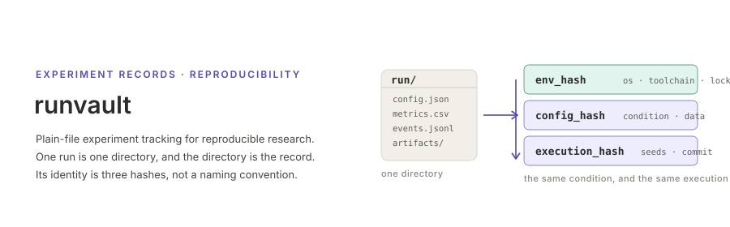

<p align="center"></p>

[English](README.md) | **日本語**

# runvault

再現可能な研究のための，プレーンファイルによる実験記録．

1 回の実行が 1 つのディレクトリであり，そのディレクトリが記録の正本である．その上に乗る層 —— DuckDB インデックス，ダッシュボード，その他のトラッキング UI —— はすべてそれらのファイルを読むだけの派生物で，記録に触れずに取り外せる．run を比較可能にするのは命名規約ではなく，3 段に積まれたハッシュである．`env_hash`（マシンとツールチェイン），`config_hash`（実験条件と，使用したデータの同一性），`execution_hash`（その条件に加えて seed・commit・環境）．したがって「同じ条件か」「同じ実行の繰り返しか」を機械が判定できる．`runvault` はシミュレーション（ABM），LLM 安全性評価，異常検知の実験を *同じ形* で記録するので，リポジトリをまたいでも年をまたいでも run を比較できる．

本リポジトリには Rust ライブラリ，Rust のコマンドライン，そして Python パッケージが入っている．Python 版は読むだけの薄いクライアントではなく，run を書き出す完全な第 2 実装である．`schema/v1/` のスキーマは凍結されており，2 つの実装は同じ実装間テストベクタで突き合わされる．

## インストール

Rust から run を記録する．データベースは一切引き込まない：

```toml
[dependencies]
runvault = { git = "https://github.com/akitenkrad/rs-runvault" }
```

Python から run を記録する．同じプロジェクトで解析もするなら `runvault[read]` を使う：

```toml
[project]
dependencies = ["runvault"]

[tool.uv.sources]
runvault = { git = "https://github.com/akitenkrad/rs-runvault", subdirectory = "python" }
```

DuckDB インデックスを持つコマンドライン：

```bash
cargo install --git https://github.com/akitenkrad/rs-runvault runvault-cli
runvault --help
```

## ドキュメント

| | |
| --- | --- |
| [概要](docs/overview.ja.md) | 何が問題で，3 つのハッシュが何をもたらすか |
| [run ディレクトリ](docs/run-directory.ja.md) | レイアウトと，各ファイルの役割 |
| [同一性](docs/identity.ja.md) | 3 つのハッシュ，正規化，`run_uid` と `run_slug` |
| [Rust](docs/rust.ja.md) | ライブラリからの記録と，crate が 2 つある理由 |
| [Python](docs/python.ja.md) | Python からの記録と読み出し |
| [コマンドライン](docs/cli.ja.md) | 全サブコマンドとフラグ |
| [保全](docs/preservation.ja.md) | `verify` → `sync` → `query` → `report` |
| [検査](docs/checks.ja.md) | run が満たすべき不変条件と，その実行方法 |
| [スキーマ](docs/schemas.ja.md) | `schema/v1/`，テストベクタ，CI が守らせていること |

## ライセンス

[Apache License, Version 2.0](LICENSE-APACHE) または [MIT license](LICENSE-MIT) のいずれか，利用者の選択によりライセンスされる．

明示的に別段の意思表示をしない限り，Apache-2.0 ライセンスに定義される，利用者が本 crate への包含を意図して提出した貢献は，追加の条項・条件なしに上記のデュアルライセンスとする．
